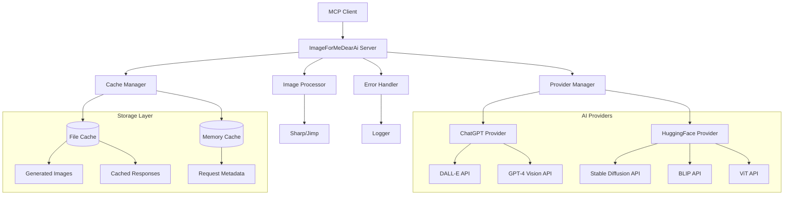

<div align="center">

# 🎨 ImageForMeDearAi

**Professional AI-Powered Image Generation MCP Server**

[](https://badge.fury.io/js/image-for-me-dear-ai)
[](https://opensource.org/licenses/MIT)
[](http://www.typescriptlang.org/)
[](https://nodejs.org/)
[](https://modelcontextprotocol.io/)

A robust **Model Context Protocol (MCP) server** that provides enterprise-grade AI-powered image generation, analysis, and logo creation tools. Built with TypeScript and featuring intelligent dual provider support with automatic fallback between ChatGPT/DALL-E and HuggingFace models.

[Features](#-features) • [Quick Start](#-quick-start) • [API Reference](#-api-reference) • [Configuration](#%EF%B8%8F-configuration) • [Documentation](#-documentation)

</div>

## ✨ Core Features
### 🖼️ Image Generation
- **Multiple AI Providers**: ChatGPT/DALL-E and HuggingFace/Stable Diffusion
- **15+ Artistic Styles**: Realistic, cartoon, anime, oil-painting, watercolor, cyberpunk, and more
- **Flexible Dimensions**: Custom width/height with intelligent aspect ratio handling
- **Quality Control**: Standard and HD quality options
- **Format Support**: PNG, JPEG, WebP output formats

### 🏷️ Logo Generation
- **Professional Quality**: Transparent PNG logos perfect for branding
- **Logo Types**: Text-only, icon-only, or combination logos
- **Style Options**: Minimalist, modern, vintage, professional, creative, elegant
- **Color Control**: Custom primary/secondary colors and backgrounds
- **Industry Optimization**: Tailored designs for different business sectors

### 🔍 Image Analysis
- **Smart Description**: AI-powered image description with multiple detail levels
- **Intelligent Tagging**: Automatic object and scene recognition
- **Category Organization**: Structured tags by objects, people, places, activities
- **Confidence Scoring**: Reliability metrics for all analysis results

### ⚡ Performance & Reliability
- **Intelligent Caching**: Fast repeated requests with configurable cache settings
- **Fallback System**: Automatic provider switching for high availability
- **Error Handling**: Comprehensive error management with user-friendly messages
- **Retry Logic**: Automatic retries with exponential backoff

## 🚀 Quick Start

### NPM Installation (Recommended)

```bash
npm install -g image-for-me-dear-ai
```

Then run the setup:
```bash
image-for-me-dear-ai
```

### Development Installation

1. **Clone and install dependencies**:
   ```bash
   git clone https://github.com/bramato/ImageForMeDearAi.git
   cd ImageForMeDearAi
   npm install
   ```

2. **Run the interactive setup**:
   ```bash
   npm run install-providers
   ```
   
   This will guide you through:
   - Provider selection (ChatGPT/HuggingFace)
   - API key configuration
   - Model selection

### 🤖 AI Editor Integration

**Quick Setup Guides for Popular AI Code Editors:**

| Editor | Setup Guide | Features |
|--------|-------------|----------|
| 🎯 **Cursor** | [📋 Cursor Setup Guide](./CURSOR_SETUP.md) | AI chat integration, workflow automation |
| 🧠 **Claude Code** | [📋 Claude Code Setup Guide](./CLAUDE_CODE_SETUP.md) | MCP protocol, advanced configuration |

**What you get:**
- ✅ Direct AI chat integration
- ✅ Image generation within your editor  
- ✅ Real-time image analysis
- ✅ Logo creation for projects
- ✅ Documentation image generation

3. **Build the server**:
   ```bash
   npm run build
   ```

4. **Start the server**:
   ```bash
   npm start
   ```

### Quick Configuration

Alternatively, create a `.env` file with your API keys:

```env
# OpenAI/ChatGPT Configuration
OPENAI_API_KEY=your-openai-api-key
CHATGPT_ENABLED=true
CHATGPT_MODEL=dall-e-3

# HuggingFace Configuration
HUGGINGFACE_API_KEY=your-huggingface-token
HUGGINGFACE_ENABLED=true
HUGGINGFACE_MODEL=stabilityai/stable-diffusion-xl-base-1.0

# General Settings
OUTPUT_DIRECTORY=./generated-images
CACHE_ENABLED=true
CACHE_MAX_SIZE=100
```

## 🛠️ API Reference

### Tool Overview

| Tool | Purpose | Primary Provider | Fallback |
|------|---------|------------------|----------|
| `generate_image` | AI image generation with artistic styles | ChatGPT/DALL-E | HuggingFace/SD |
| `generate_logo` | Professional logo creation | ChatGPT/DALL-E | HuggingFace/SD |
| `describe_image` | AI-powered image analysis | GPT-4 Vision | HuggingFace BLIP |
| `tag_image` | Intelligent image tagging | GPT-4 Vision | HuggingFace ViT |

### Tool Specifications

#### `generate_image`

**Purpose:** Generate high-quality images with extensive artistic style control and professional output options.

**Input Schema:**
```typescript
interface GenerateImageArgs {
  prompt: string;              // Required: 1-4000 characters
  style?: ImageStyle;          // Optional: See style reference below
  width?: number;              // Optional: 64-2048px (default: 1024)
  height?: number;             // Optional: 64-2048px (default: 1024)
  quality?: 'standard' | 'hd'; // Optional: Image quality level
  count?: number;              // Optional: 1-10 images (default: 1)
  format?: 'png' | 'jpeg' | 'webp'; // Optional: Output format
  provider?: 'chatgpt' | 'huggingface'; // Optional: Force provider
}
```

**Response:**
```typescript
interface ImageGenerationResult {
  success: boolean;
  images: Array<{
    url: string;
    localPath?: string;
    format: string;
    dimensions: { width: number; height: number };
    size: number;
  }>;
  provider: string;
  requestId: string;
  cached?: boolean;
  metadata: {
    style?: string;
    processingTime: number;
    cacheHit: boolean;
  };
}
```

**Example Usage:**
```json
{
  "prompt": "A serene mountain landscape at sunset with dramatic clouds",
  "style": "oil-painting",
  "width": 1024,
  "height": 768,
  "quality": "hd",
  "format": "png"
}
```

#### `generate_logo`

**Purpose:** Create professional logos with transparent backgrounds, perfect for branding and commercial use.

**Input Schema:**
```typescript
interface GenerateLogoArgs {
  prompt: string;                    // Required: Logo description
  logoType: 'text' | 'icon' | 'combination'; // Required: Logo type
  businessName?: string;             // Optional: Company name
  style?: LogoStyle;                 // Optional: See logo styles below
  primaryColor?: string;             // Optional: Hex color code
  secondaryColor?: string;           // Optional: Hex color code
  backgroundColor?: string;          // Optional: Background color
  industry?: string;                 // Optional: Business industry
  width?: number;                    // Optional: 128-1024px (default: 512)
  height?: number;                   // Optional: 128-1024px (default: 512)
  transparent?: boolean;             // Optional: Transparent background
}
```

**Logo Styles:**
- `minimalist` - Clean, simple designs
- `modern` - Contemporary styling
- `vintage` - Retro, classic aesthetics
- `professional` - Corporate, business-oriented
- `creative` - Artistic, unique designs
- `elegant` - Sophisticated, refined
- `playful` - Fun, energetic designs
- `bold` - Strong, impactful styling

**Example Usage:**
```json
{
  "prompt": "Modern tech startup logo with AI elements",
  "logoType": "combination",
  "businessName": "InnovateTech",
  "style": "minimalist",
  "primaryColor": "#2563eb",
  "secondaryColor": "#1e40af",
  "industry": "technology",
  "transparent": true,
  "width": 512,
  "height": 512
}
```

#### `describe_image`

**Purpose:** Analyze and describe image content with AI vision models for accessibility, content moderation, and metadata generation.

**Input Schema:**
```typescript
interface DescribeImageArgs {
  imageUrl: string;                           // Required: Valid image URL
  detailLevel?: 'brief' | 'detailed' | 'comprehensive'; // Optional: Analysis depth
  focus?: string;                             // Optional: Specific focus area
  includeObjects?: boolean;                   // Optional: Include object detection
  includeText?: boolean;                      // Optional: Include OCR text
  includeColors?: boolean;                    // Optional: Include color analysis
  provider?: 'chatgpt' | 'huggingface';      // Optional: Force provider
}
```

**Response:**
```typescript
interface ImageDescriptionResult {
  success: boolean;
  description: string;
  confidence: number;
  detailLevel: string;
  metadata: {
    objects?: Array<{ name: string; confidence: number }>;
    colors?: Array<{ color: string; percentage: number }>;
    text?: Array<{ content: string; confidence: number }>;
    dimensions: { width: number; height: number };
    fileSize: number;
    format: string;
  };
  provider: string;
  processingTime: number;
}
```

**Example Usage:**
```json
{
  "imageUrl": "https://example.com/office-meeting.jpg",
  "detailLevel": "comprehensive",
  "focus": "people and activities",
  "includeObjects": true,
  "includeColors": true
}
```

#### `tag_image`

**Purpose:** Extract structured tags and metadata from images for content management, search optimization, and categorization.

**Input Schema:**
```typescript
interface TagImageArgs {
  imageUrl: string;                    // Required: Valid image URL
  maxTags?: number;                    // Optional: 1-50 tags (default: 10)
  minConfidence?: number;              // Optional: 0.0-1.0 (default: 0.3)
  categories?: TagCategory[];          // Optional: Filter categories
  includeColors?: boolean;             // Optional: Color palette analysis
  includeAttributes?: boolean;         // Optional: Visual attributes
  language?: string;                   // Optional: Output language (default: 'en')
}

type TagCategory = 'objects' | 'people' | 'animals' | 'places' | 'activities' | 'emotions' | 'food' | 'nature' | 'technology' | 'art';
```

**Response:**
```typescript
interface ImageTaggingResult {
  success: boolean;
  tags: Array<{
    name: string;
    confidence: number;
    category: TagCategory;
    boundingBox?: { x: number; y: number; width: number; height: number };
  }>;
  colors: Array<{
    color: string;
    percentage: number;
    hex: string;
    rgb: { r: number; g: number; b: number };
  }>;
  attributes: {
    brightness: number;
    contrast: number;
    saturation: number;
    sharpness: number;
  };
  metadata: {
    totalTags: number;
    averageConfidence: number;
    processingTime: number;
    dominantColors: string[];
  };
  provider: string;
}
```

**Example Usage:**
```json
{
  "imageUrl": "https://example.com/landscape-photo.jpg",
  "maxTags": 15,
  "minConfidence": 0.4,
  "categories": ["nature", "places", "objects"],
  "includeColors": true,
  "includeAttributes": true,
  "language": "en"
}
```
## 🎨 Available Styles

Choose from 15+ artistic styles for image generation:

| Style | Description | Best For |
|-------|-------------|----------|
| `realistic` | Photorealistic images | Professional photos, portraits |
| `cartoon` | Fun, colorful cartoon style | Children's content, playful designs |
| `anime` | Japanese anime/manga style | Character art, stylized illustrations |
| `oil-painting` | Classical oil painting | Fine art, traditional aesthetics |
| `watercolor` | Soft watercolor effects | Gentle, artistic illustrations |
| `sketch` | Hand-drawn pencil sketch | Concept art, rough designs |
| `digital-art` | Modern digital artwork | Contemporary designs |
| `cyberpunk` | Futuristic neon aesthetic | Sci-fi, technology themes |
| `steampunk` | Victorian industrial style | Retro-futuristic designs |
| `minimalist` | Clean, simple design | Modern, professional looks |
| `vintage` | Retro, nostalgic style | Classic, timeless designs |
| `pop-art` | Bold, colorful pop art | Eye-catching, commercial art |
| `surreal` | Dreamlike, fantastical | Creative, imaginative scenes |
| `photographic` | Professional photography | High-quality, realistic images |
| `abstract` | Non-representational art | Artistic, experimental designs |

## ⚙️ Configuration

### Environment Variables

Create a `.env` file in your project root with the following configuration:
```bash
# ===========================================
# AI Provider Configuration
# ===========================================

# OpenAI/ChatGPT Configuration
OPENAI_API_KEY=your-openai-api-key-here
CHATGPT_ENABLED=true
CHATGPT_MODEL=dall-e-3                    # dall-e-3, dall-e-2
CHATGPT_VISION_MODEL=gpt-4-vision-preview # For image analysis
CHATGPT_QUALITY=standard                  # standard, hd
CHATGPT_SIZE=1024x1024                   # 256x256, 512x512, 1024x1024, 1024x1792, 1792x1024

# HuggingFace Configuration
HUGGINGFACE_API_KEY=your-huggingface-token-here
HUGGINGFACE_ENABLED=true
HUGGINGFACE_MODEL=stabilityai/stable-diffusion-xl-base-1.0
HUGGINGFACE_VISION_MODEL=Salesforce/blip-image-captioning-large
HUGGINGFACE_TAGGING_MODEL=google/vit-base-patch16-224

# ===========================================
# Server Configuration
# ===========================================

# Output Settings
OUTPUT_DIRECTORY=./generated-images
OUTPUT_FORMAT=png                         # png, jpeg, webp
OUTPUT_QUALITY=95                         # 1-100 for JPEG/WebP
OUTPUT_NAMING_PATTERN={{timestamp}}-{{hash}}-{{provider}}

# Cache Configuration
CACHE_ENABLED=true
CACHE_DIRECTORY=./cache
CACHE_TTL=86400000                        # 24 hours in milliseconds
CACHE_MAX_SIZE=100                        # Maximum cached items
CACHE_MAX_FILE_SIZE=50000000             # 50MB max file size

# Performance Settings
MAX_CONCURRENT_REQUESTS=5
REQUEST_TIMEOUT=120000                    # 2 minutes in milliseconds
RETRY_ATTEMPTS=3
RETRY_DELAY=2000                          # 2 seconds

# Logging Configuration
LOG_LEVEL=info                            # debug, info, warn, error
LOG_FILE=./logs/server.log
LOG_MAX_SIZE=10000000                     # 10MB
LOG_MAX_FILES=5

# Security Settings
RATE_LIMIT_ENABLED=true
RATE_LIMIT_WINDOW=60000                   # 1 minute
RATE_LIMIT_MAX_REQUESTS=100               # Max requests per window
CONTENT_POLICY_ENABLED=true               # Enable content filtering

# ===========================================
# Feature Flags
# ===========================================

FEATURE_IMAGE_GENERATION=true
FEATURE_LOGO_GENERATION=true
FEATURE_IMAGE_DESCRIPTION=true
FEATURE_IMAGE_TAGGING=true
FEATURE_BATCH_PROCESSING=false            # Coming soon
FEATURE_WEBHOOK_NOTIFICATIONS=false       # Coming soon
```

### Configuration File

For advanced configuration, create a `config/server.json` file:

```json
{
  "server": {
    "name": "image-for-me-dear-ai",
    "version": "1.2.0",
    "port": 3000,
    "host": "localhost"
  },
  "providers": {
    "chatgpt": {
      "priority": 1,
      "timeout": 30000,
      "retries": 3,
      "features": ["generation", "description", "logo"],
      "models": {
        "generation": "dall-e-3",
        "description": "gpt-4-vision-preview"
      }
    },
    "huggingface": {
      "priority": 2,
      "timeout": 60000,
      "retries": 2,
      "features": ["generation", "description", "tagging"],
      "models": {
        "generation": "stabilityai/stable-diffusion-xl-base-1.0",
        "description": "Salesforce/blip-image-captioning-large",
        "tagging": "google/vit-base-patch16-224"
      }
    }
  },
  "cache": {
    "strategy": "filesystem",
    "compression": true,
    "cleanup": {
      "enabled": true,
      "schedule": "0 2 * * *",
      "maxAge": "7d"
    }
  },
  "monitoring": {
    "metrics": {
      "enabled": true,
      "endpoint": "/metrics"
    },
    "health": {
      "enabled": true,
      "endpoint": "/health"
    }
  }
}
```

### Provider Details

#### OpenAI/ChatGPT Provider

**Capabilities:**
- **Image Generation**: DALL-E 3 (premium quality), DALL-E 2 (cost-effective)
- **Image Description**: GPT-4 Vision (highly accurate, contextual)
- **Logo Generation**: Specialized logo prompts with transparency support
- **Quality Options**: Standard (faster) or HD (higher quality)
- **Rate Limits**: 50 requests/minute (DALL-E 3), 100 requests/minute (DALL-E 2)
- **Supported Formats**: PNG, JPEG
- **Max Resolution**: 1024x1792, 1792x1024 (DALL-E 3), 1024x1024 (DALL-E 2)
- **API Documentation**: [OpenAI Platform](https://platform.openai.com/docs)

#### HuggingFace Provider

**Capabilities:**
- **Image Generation**: Stable Diffusion XL, SD 2.1, custom models
- **Image Description**: BLIP models for detailed captions
- **Image Tagging**: Vision Transformer (ViT) for object recognition
- **Custom Models**: Support for fine-tuned and community models
- **Rate Limits**: 1000 requests/hour (free tier), unlimited (pro)
- **Supported Formats**: PNG, JPEG, WebP
- **Max Resolution**: 1024x1024 (standard), 2048x2048 (XL models)
- **API Documentation**: [HuggingFace Inference](https://huggingface.co/docs/api-inference)

### Advanced Configuration Options

#### Image Processing Pipeline

```typescript
// Custom image processing configuration
interface ProcessingConfig {
  upscaling?: {
    enabled: boolean;
    algorithm: 'bicubic' | 'lanczos' | 'ai';
    maxResolution: number;
  };
  watermark?: {
    enabled: boolean;
    text?: string;
    image?: string;
    position: 'top-left' | 'top-right' | 'bottom-left' | 'bottom-right' | 'center';
    opacity: number;
  };
  optimization?: {
    enabled: boolean;
    quality: number;
    progressive: boolean;
    stripMetadata: boolean;
  };
}
```

#### Multi-tenant Configuration

```json
{
  "multiTenant": {
    "enabled": true,
    "tenants": {
      "tenant-1": {
        "providers": ["chatgpt"],
        "quotas": {
          "daily": 100,
          "monthly": 2000
        },
        "features": ["generation", "description"]
      },
      "tenant-2": {
        "providers": ["huggingface"],
        "quotas": {
          "daily": 500,
          "monthly": 10000
        },
        "features": ["generation", "tagging"]
      }
    }
  }
}
```

## 🏗️ Architecture

### System Overview



### Core Components

#### 1. Provider Manager
Coordinates multiple AI providers with intelligent failover:

```typescript
class ProviderManager {
  private providers: Map<string, ImageProvider>;
  private fallbackChain: string[];
  
  async executeWithFallback<T>(
    operation: (provider: ImageProvider) => Promise<T>,
    preferredProvider?: string
  ): Promise<T> {
    // Implementation handles automatic failover
  }
}
```

#### 2. Intelligent Caching System
Multi-layered caching for optimal performance:

- **L1 Cache**: In-memory cache for recent requests
- **L2 Cache**: Persistent filesystem cache
- **Cache Strategies**: LRU eviction, TTL-based expiration
- **Smart Invalidation**: Content-aware cache invalidation

#### 3. Error Handling & Resilience

```typescript
interface ErrorContext {
  provider: string;
  operation: string;
  requestId: string;
  retryCount: number;
  originalError: Error;
}

class ErrorHandler {
  handleProviderError(error: ProviderError): McpToolResponse;
  shouldRetry(error: Error, context: ErrorContext): boolean;
  getBackoffDelay(retryCount: number): number;
}
```

### Design Patterns

#### Provider Pattern
```typescript
interface ImageProvider {
  name: string;
  isAvailable(): Promise<boolean>;
  supportsFeature(feature: ProviderFeature): boolean;
  generateImage(request: ImageGenerationRequest): Promise<ImageGenerationResult>;
}

// Concrete implementations
class ChatGptProvider implements ImageProvider { /* ... */ }
class HuggingFaceProvider implements ImageProvider { /* ... */ }
```

#### Strategy Pattern for Caching
```typescript
interface CacheStrategy {
  get<T>(key: string): Promise<T | null>;
  set<T>(key: string, value: T, ttl?: number): Promise<void>;
  invalidate(pattern: string): Promise<void>;
}

class FilesystemCacheStrategy implements CacheStrategy { /* ... */ }
class MemoryCacheStrategy implements CacheStrategy { /* ... */ }
class RedisCacheStrategy implements CacheStrategy { /* ... */ }
```

#### Observer Pattern for Monitoring
```typescript
interface PerformanceObserver {
  onRequestStart(requestId: string, metadata: RequestMetadata): void;
  onRequestComplete(requestId: string, result: OperationResult): void;
  onError(requestId: string, error: Error): void;
}
```

### Performance Characteristics

| Operation | Cold Start | Warm Cache | Provider Fallback |
|-----------|------------|------------|-------------------|
| Image Generation | 5-15s | <1s | +2-5s |
| Image Description | 2-8s | <0.5s | +1-3s |
| Image Tagging | 1-5s | <0.2s | +0.5-2s |
| Logo Generation | 8-20s | <1s | +3-8s |

### Scalability Considerations

- **Horizontal Scaling**: Stateless design enables load balancing
- **Resource Management**: Configurable concurrency limits
- **Memory Optimization**: Streaming for large files, memory-efficient processing
- **Database Integration**: Ready for external cache stores (Redis, MongoDB)

## 📊 Monitoring & Operations

### Health Monitoring

#### System Health Endpoint
```bash
# Check overall system health
curl http://localhost:3000/health

# Response
{
  "status": "healthy",
  "timestamp": "2024-01-15T10:30:00Z",
  "version": "1.1.0",
  "uptime": 86400,
  "providers": {
    "chatgpt": {
      "status": "available",
      "latency": 1200,
      "successRate": 0.98
    },
    "huggingface": {
      "status": "available",
      "latency": 3400,
      "successRate": 0.94
    }
  },
  "cache": {
    "hitRate": 0.75,
    "size": 42,
    "maxSize": 100
  },
  "resources": {
    "memoryUsage": 0.45,
    "diskSpace": 0.67,
    "cpuUsage": 0.23
  }
}
```

#### Performance Metrics
```bash
# Get detailed metrics
curl http://localhost:3000/metrics

# Prometheus-compatible output
# TYPE image_generation_requests_total counter
image_generation_requests_total{provider="chatgpt",status="success"} 142
image_generation_requests_total{provider="chatgpt",status="error"} 3
image_generation_requests_total{provider="huggingface",status="success"} 89

# TYPE image_generation_duration_seconds histogram
image_generation_duration_seconds_bucket{provider="chatgpt",le="5"} 45
image_generation_duration_seconds_bucket{provider="chatgpt",le="10"} 120

# TYPE cache_hit_rate gauge
cache_hit_rate 0.75
```

### Logging Configuration

#### Structured Logging
```typescript
interface LogEntry {
  timestamp: string;
  level: 'debug' | 'info' | 'warn' | 'error';
  requestId?: string;
  provider?: string;
  operation: string;
  duration?: number;
  message: string;
  metadata?: Record<string, any>;
  error?: {
    name: string;
    message: string;
    stack?: string;
  };
}
```

#### Log Levels
- **DEBUG**: Detailed execution flow, parameter values
- **INFO**: Successful operations, cache hits, provider switches
- **WARN**: Non-critical errors, fallback activations, rate limits
- **ERROR**: Failed operations, provider failures, system errors

### Development & Debugging

#### Development Mode
```bash
# Start with hot reload and detailed logging
npm run dev

# Enable debug logging
DEBUG=image-for-me-dear-ai:* npm run dev

# Test specific providers
PROVIDER=chatgpt npm run dev
PROVIDER=huggingface npm run dev
```

#### Testing Tools
```bash
# Run comprehensive test suite
npm test

# Run specific test categories
npm run test:unit
npm run test:integration
npm run test:providers

# Performance benchmarks
npm run benchmark

# Load testing
npm run test:load
```

#### Debug Utilities
```bash
# Validate configuration
npm run validate-config

# Test provider connectivity
npm run test-providers

# Cache inspection
npm run cache:stats
npm run cache:clear

# Generate test images
npm run generate-samples
```

### Production Deployment

#### Docker Deployment
```dockerfile
# Dockerfile
FROM node:18-alpine
WORKDIR /app
COPY package*.json ./
RUN npm ci --only=production
COPY dist ./dist
COPY config ./config
EXPOSE 3000
HEALTHCHECK --interval=30s --timeout=10s --start-period=5s --retries=3 \
  CMD curl -f http://localhost:3000/health || exit 1
USER node
CMD ["npm", "start"]
```

```yaml
# docker-compose.yml
version: '3.8'
services:
  image-generator:
    build: .
    ports:
      - "3000:3000"
    environment:
      - NODE_ENV=production
      - LOG_LEVEL=info
    volumes:
      - ./generated-images:/app/generated-images
      - ./cache:/app/cache
      - ./logs:/app/logs
    restart: unless-stopped
    healthcheck:
      test: ["CMD", "curl", "-f", "http://localhost:3000/health"]
      interval: 30s
      timeout: 10s
      retries: 3
```

## 🔒 Security & Compliance

### Security Features

#### API Key Protection
- **Environment Variables**: Secure key storage
- **Key Rotation**: Support for seamless key updates
- **Scope Validation**: Verify API key permissions
- **Encryption at Rest**: Encrypted configuration files

```bash
# Secure key management
echo "OPENAI_API_KEY=$(openssl rand -hex 32)" >> .env.local
chmod 600 .env.local
```

#### Content Security
```typescript
interface ContentPolicy {
  enabled: boolean;
  providers: {
    openai: {
      useContentFilter: boolean;
      blockExplicit: boolean;
    };
    huggingface: {
      useNsfwFilter: boolean;
      customFilters: string[];
    };
  };
  customRules: {
    bannedTerms: string[];
    requiredTerms: string[];
    maxPromptLength: number;
  };
}
```

#### Rate Limiting & DoS Protection
```typescript
interface RateLimitConfig {
  windowMs: number;        // Time window in milliseconds
  maxRequests: number;     // Max requests per window
  skipSuccessfulRequests: boolean;
  skipFailedRequests: boolean;
  keyGenerator: (req: Request) => string;
  onLimitReached: (req: Request) => void;
}
```

### Compliance & Privacy

#### GDPR Compliance
- **Data Minimization**: Only necessary data collection
- **Right to Deletion**: Automated data purging
- **Data Portability**: Export user-generated content
- **Consent Management**: Explicit permission tracking

#### SOC 2 Alignment
- **Access Controls**: Role-based permissions
- **Audit Logging**: Comprehensive activity tracking
- **Encryption**: Data encryption in transit and at rest
- **Monitoring**: Continuous security monitoring

### Best Practices

#### Production Security Checklist
- [ ] Use strong, unique API keys
- [ ] Enable HTTPS/TLS encryption
- [ ] Configure proper CORS policies
- [ ] Set up rate limiting
- [ ] Enable audit logging
- [ ] Regular security updates
- [ ] Monitor for suspicious activity
- [ ] Implement backup strategies
- [ ] Test disaster recovery
- [ ] Document security procedures

#### Secure Development Guidelines

**Environment Setup:**
```bash
# Use separate environments
cp .env.example .env.development
cp .env.example .env.staging  
cp .env.example .env.production

# Set restrictive permissions
chmod 600 .env.*

# Use environment-specific configurations
NODE_ENV=production npm start
```

**Input Sanitization:**
```typescript
// Automatic input validation and sanitization
const validatePrompt = (prompt: string): string => {
  return prompt
    .trim()
    .replace(/[<>"'&]/g, '') // Remove HTML/script injection
    .substring(0, 4000)       // Limit length
    .replace(/\b(password|token|key)\b/gi, '[REDACTED]'); // Redact sensitive terms
};
```

**Audit Trail:**
```typescript
interface AuditEvent {
  timestamp: string;
  userId?: string;
  sessionId: string;
  operation: string;
  provider: string;
  resources: string[];
  outcome: 'success' | 'failure' | 'error';
  ipAddress: string;
  userAgent: string;
  metadata: Record<string, any>;
}
```

## 🤝 Contributing

### Development Setup

1. **Fork and Clone**
   ```bash
   git clone https://github.com/your-username/ImageForMeDearAi.git
   cd ImageForMeDearAi
   git remote add upstream https://github.com/bramato/ImageForMeDearAi.git
   ```

2. **Environment Setup**
   ```bash
   npm install
   cp .env.example .env.development
   # Configure your API keys in .env.development
   ```

3. **Development Workflow**
   ```bash
   # Create feature branch
   git checkout -b feature/your-feature-name
   
   # Start development server
   npm run dev
   
   # Run tests continuously
   npm run test:watch
   
   # Lint and format
   npm run lint:fix
   npm run format
   ```

### Contribution Guidelines

#### Code Standards
- **TypeScript**: Strict type checking enabled
- **ESLint**: Extended from `@typescript-eslint/recommended`
- **Prettier**: Consistent code formatting
- **Conventional Commits**: Semantic commit messages

#### Testing Requirements
```bash
# Unit tests for new features
npm run test:unit

# Integration tests for providers
npm run test:integration

# E2E tests for complete workflows
npm run test:e2e

# Performance benchmarks
npm run benchmark

# Coverage requirements: >90%
npm run test:coverage
```

#### Pull Request Process

1. **Pre-PR Checklist**
   - [ ] All tests pass
   - [ ] Code coverage >90%
   - [ ] Documentation updated
   - [ ] Changelog entry added
   - [ ] No breaking changes (or marked as such)

2. **PR Description Template**
   ```markdown
   ## Description
   Brief description of changes
   
   ## Type of Change
   - [ ] Bug fix
   - [ ] New feature
   - [ ] Breaking change
   - [ ] Documentation update
   
   ## Testing
   - [ ] Unit tests added/updated
   - [ ] Integration tests pass
   - [ ] Manual testing completed
   
   ## Checklist
   - [ ] Code follows style guidelines
   - [ ] Self-review completed
   - [ ] Documentation updated
   - [ ] No new warnings
   ```

#### Areas for Contribution

**High Priority:**
- Additional AI providers (Midjourney, Replicate)
- Advanced image editing capabilities
- Batch processing improvements
- Performance optimizations

**Medium Priority:**
- UI/Dashboard development
- Additional image formats
- Custom model integration
- Monitoring improvements

**Documentation:**
- Tutorial videos
- Integration examples
- Best practices guides
- API reference improvements

### Community Guidelines

- **Be Respectful**: Inclusive and welcoming environment
- **Be Helpful**: Support fellow contributors
- **Be Patient**: Constructive feedback and reviews
- **Follow CoC**: Adhere to our Code of Conduct

### Recognition

Contributors are recognized in:
- GitHub contributors page
- Changelog acknowledgments
- Annual contributor highlights
- Special badges for significant contributions

## 📄 License & Legal

### MIT License

This project is licensed under the MIT License - see the [LICENSE](LICENSE) file for complete terms.

**Key Points:**
- ✅ Commercial use permitted
- ✅ Modification and distribution allowed
- ✅ Private use permitted
- ❗ No warranty provided
- ❗ Attribution required

### Third-Party Licenses

| Component | License | Usage |
|-----------|---------|-------|
| OpenAI API | [OpenAI Terms](https://openai.com/terms/) | Image generation |
| HuggingFace | [Apache 2.0](https://apache.org/licenses/LICENSE-2.0) | Model inference |
| Sharp | [Apache 2.0](https://apache.org/licenses/LICENSE-2.0) | Image processing |
| TypeScript | [Apache 2.0](https://apache.org/licenses/LICENSE-2.0) | Language support |

### Usage Rights

**Generated Content:**
- Images created through this software are subject to the respective AI provider's terms
- Commercial use of generated images follows provider-specific licensing
- Users are responsible for compliance with applicable copyright laws

**Attribution:**
If you use this software in your project, please include:
```
Powered by ImageForMeDearAi - https://github.com/bramato/ImageForMeDearAi
```

## 🙏 Acknowledgments

### Core Contributors
- **Marco** - Original author and maintainer
- **Community Contributors** - Feature enhancements and bug fixes

### Special Thanks
- **OpenAI Team** - DALL-E API and GPT-4 Vision
- **HuggingFace Community** - Open-source AI models
- **MCP Protocol Team** - Model Context Protocol specification
- **TypeScript Team** - Language and tooling support

### Inspiration
This project was inspired by the need for a unified, professional-grade image generation solution that could work seamlessly with multiple AI providers while maintaining enterprise standards for reliability and performance.

## 🆘 Troubleshooting & Support

### Common Issues & Solutions

#### Installation Issues

**Problem**: `npm install` fails with permission errors
```bash
# Solution: Use node version manager
nvm install 18
nvm use 18
npm install -g npm@latest

# Or fix npm permissions
sudo chown -R $(whoami) ~/.npm
```

**Problem**: TypeScript compilation errors
```bash
# Solution: Clean build and reinstall
npm run clean
rm -rf node_modules package-lock.json
npm install
npm run build
```

#### Provider Configuration

**Problem**: "No providers available" error
```typescript
// Check provider configuration
const diagnosis = {
  openaiKey: !!process.env.OPENAI_API_KEY,
  huggingfaceKey: !!process.env.HUGGINGFACE_API_KEY,
  providersEnabled: process.env.CHATGPT_ENABLED || process.env.HUGGINGFACE_ENABLED
};
console.log('Provider Diagnosis:', diagnosis);
```

**Solution:**
1. Verify API keys are set correctly
2. Check provider availability with test endpoints
3. Ensure network connectivity
4. Validate API key permissions

#### Performance Issues

**Problem**: Slow image generation
```bash
# Enable performance monitoring
DEBUG=image-for-me-dear-ai:performance npm start

# Check cache hit rates
curl http://localhost:3000/metrics | grep cache_hit_rate

# Monitor provider latency
curl http://localhost:3000/health | jq '.providers'
```

**Solutions:**
- Enable caching: `CACHE_ENABLED=true`
- Increase cache size: `CACHE_MAX_SIZE=200`
- Use faster provider: `PROVIDER=chatgpt`
- Optimize image dimensions

### Error Codes Reference

| Code | Category | Description | Solution |
|------|----------|-------------|----------|
| `E001` | Authentication | Invalid API key | Check API key configuration |
| `E002` | Rate Limit | Provider rate limit exceeded | Wait or switch providers |
| `E003` | Validation | Invalid input parameters | Check parameter formats |
| `E004` | Network | Connection timeout | Check network connectivity |
| `E005` | Cache | Cache operation failed | Clear cache and restart |
| `E006` | Storage | Insufficient disk space | Free up storage space |
| `E007` | Processing | Image processing failed | Try different parameters |
| `E008` | Provider | Provider service unavailable | Try alternative provider |

### Getting Help

#### Community Support
- 💬 **GitHub Discussions**: [Ask questions, share ideas](https://github.com/bramato/ImageForMeDearAi/discussions)
- 🐛 **Bug Reports**: [Report issues with detailed reproduction steps](https://github.com/bramato/ImageForMeDearAi/issues/new?template=bug_report.md)
- 💡 **Feature Requests**: [Suggest new features](https://github.com/bramato/ImageForMeDearAi/issues/new?template=feature_request.md)

#### Documentation
- 📚 **Wiki**: [Comprehensive guides and tutorials](https://github.com/bramato/ImageForMeDearAi/wiki)
- 📖 **API Docs**: [Interactive API documentation](https://bramato.github.io/ImageForMeDearAi/api)
- 🎥 **Video Tutorials**: [YouTube channel](https://youtube.com/@imageformédearai)

## 🗺️ Roadmap

### Current Version (1.2.0)
- ✅ Dual provider support (ChatGPT + HuggingFace)
- ✅ 15+ artistic styles
- ✅ Professional logo generation
- ✅ Intelligent caching system
- ✅ Comprehensive error handling
- ✅ Interactive installation script
- ✅ Enhanced documentation and UX

### Version 1.3.0 (Q2 2024)
- [ ] **Additional Providers**
  - [ ] Midjourney API integration
  - [ ] Replicate.com support
  - [ ] Stability AI direct integration

- [ ] **Enhanced Features**
  - [ ] Batch processing capabilities
  - [ ] Advanced image editing (crop, resize, filters)
  - [ ] Custom style training support
  - [ ] Webhook notifications

### Version 1.4.0 (Q3 2024)
- [ ] **Web Interface**
  - [ ] Administrative dashboard
  - [ ] Real-time monitoring
  - [ ] Usage analytics
  - [ ] User management

- [ ] **API Enhancements**
  - [ ] REST API endpoints
  - [ ] GraphQL support
  - [ ] Streaming responses
  - [ ] Bulk operations

### Version 2.0.0 (Q4 2024)
- [ ] **Advanced Capabilities**
  - [ ] Video generation support
  - [ ] 3D model generation
  - [ ] Advanced AI upscaling
  - [ ] Style transfer capabilities

- [ ] **Enterprise Features**
  - [ ] Multi-tenant architecture
  - [ ] Advanced analytics
  - [ ] Custom model deployment
  - [ ] Enterprise SSO integration

### Community Contributions
We actively encourage community involvement in roadmap planning:
- 🗳️ **Feature Voting**: [Vote on upcoming features](https://github.com/bramato/ImageForMeDearAi/discussions/categories/feature-requests)
- 💡 **Idea Submission**: [Suggest new capabilities](https://github.com/bramato/ImageForMeDearAi/discussions/new)
- 🤝 **Development Partnership**: [Contribute to development](CONTRIBUTING.md)

---

<div align="center">

### 🌟 Star History

[](https://star-history.com/#bramato/ImageForMeDearAi&Date)

### 🔗 Links

[Homepage](https://bramato.github.io/ImageForMeDearAi/) • [Documentation](https://bramato.github.io/ImageForMeDearAi/docs) • [API Reference](https://bramato.github.io/ImageForMeDearAi/api) • [Changelog](CHANGELOG.md)

Made with ❤️ for the Model Context Protocol ecosystem.

**[⬆ Back to Top](#-imageformedearai)**

</div>
